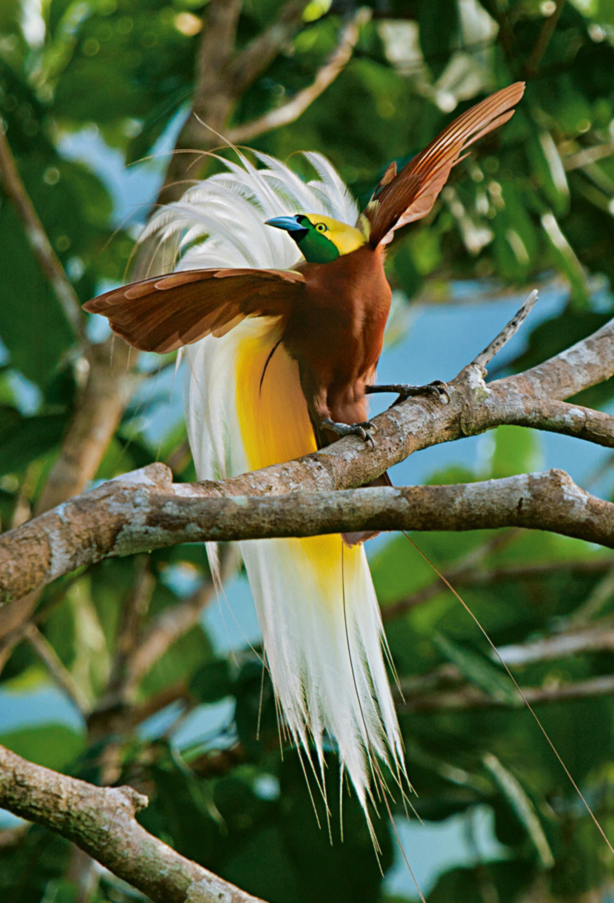
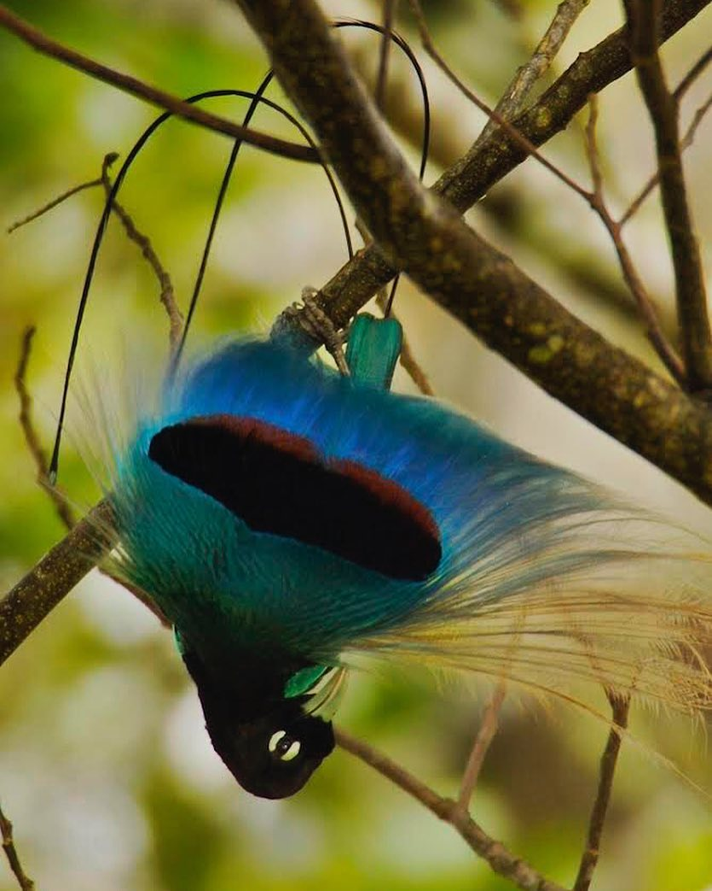
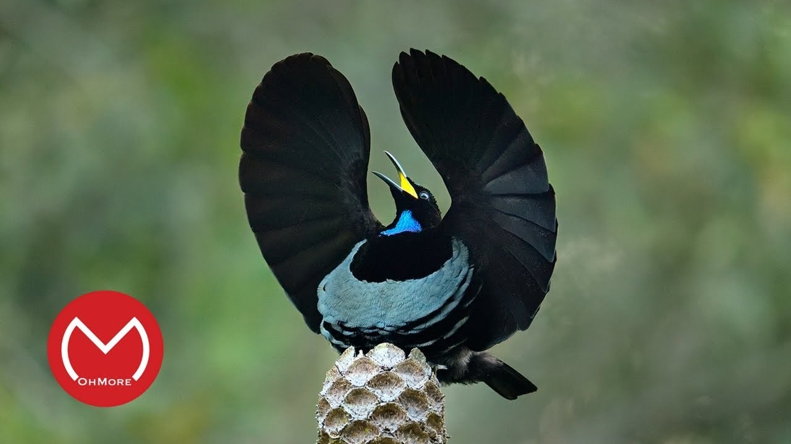
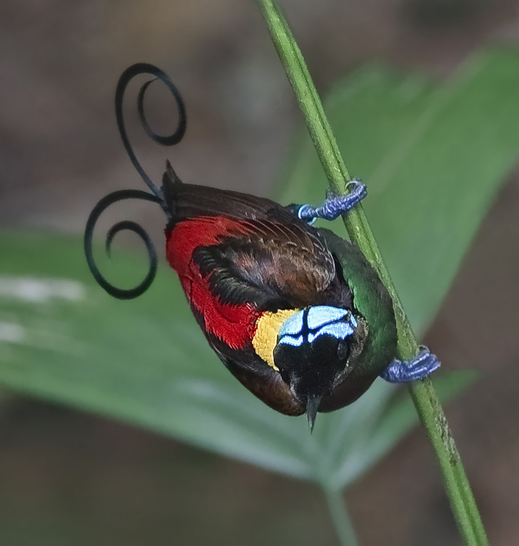
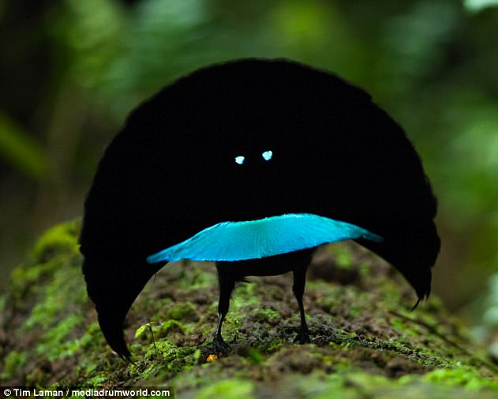
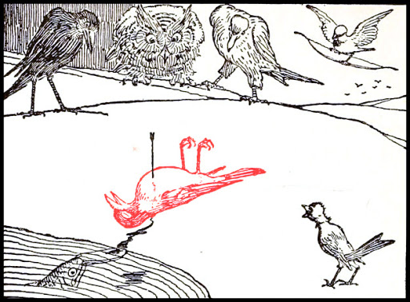

## Owls

Owls have serrated feathers along the trailing edge of their wings. What is the purpose of these feathers?
> Silent flight

A murder of crows, a gaggle of geese, a what of Owls?
> Parliament

The owl is a symbol for which Greek Goddess of wisdom, craft and warfare?
> Athena

## Other Birds

Name the enormous mythological bird  was popularised in Arabian fairy tailes and folklore, featured in Sinbad the Sailor, whose ships were sunk by stones dropped by it.
> The Roc

Which mythological bird is the national animal of Hungary
> Turul

What links the following; Corvus corax, Corvus frugilegus, Turdus merula, Prosthemadera novaeseelandiae, Coloeaus monedula, (Phalacrocorax aristotelis)
> Black; the birds are Ravens, Rooks, Blackbirds, Tui, Jackdaws and Cormorants

Which bird is considered bad luck for a sailor to kill, as mentioned in the Rime of the Ancient Mariner?
> Albatross

Anatidaephobia is the fear that somewhere what species of bird is watching you?
> Duck

Which family of birds are known for their habit of catching their prey and then impaling them on thorns or other available sharp points?
> Shrikes

Which group of predatory seabirds, known in America as Jaegers and in england by an name derived from Faroese, nest in the arctic regions and practice kleptoparasitism, where they feed on prey caught by other birds?
> Skua

Name any of the species of Auks you can encounter in the UK, seabirds that have mostly abandoned flight?
> Guillemot, Puffin, Little Auk, Razorbill

Chinstrap, Little Blue and Humboldt are all types of what bird?
> Penguins

In 2009, Stephen Fry exclaimed 'You've been shagged by a Rare Parrot!' in a BBC documentary, referring to which New Zealand bird that has a tendency to mate with people's heads?
> Kakapo

What name is given to the collective group of tropical brids shown here?

> Birds of Paradise

Which of these is the largest? The Emproer Penguin, The turkey, The Dodo or the Archeoptyryx?
> Emporer Penguin

Which species of flightless bird has a 5 inch dagger like claw on it's middle toe, and a habit of kicking things?
> Cassowary

## Bird related things

What links the following: Falcon, Eagle, Skyhawk, Blackbird, Raptor?
> All US military jet designations

What species of bird might have gotten away from a puddy tat that would cause him to exclaim 'Sufferin Succotash'
> Canary or Duck

Which bird gave it's name to a berry, originally know as marshwort or fenberry and known the the diuretic properties of the juice?
> Crane, cranberry

Who perpetrated the crime, as immortalised in the rhyme, depicted here?

> The sparrow

Zeus, noted for his many amorous misdeeds, had a habit of transforming into animals to disguise himself in his pursuits. Name any bird that Zerus disguised himself as. He disguised himself as a bird when pursuing Leda, Cassiopeia, Ganymede, Lamia, Nemesis, Thalia and Aegina
> In order, Swan, Phoenix, Eagle, Lapwing, Goose, Vulture, Eagle

Which bird was the symbol as depicted on an Aquila?
> Eagle

Why did the filming of 'The Last Jedi' necessitate the creation of a new Star Wars species, the 'Porgs'?
> The Puffins

Alouette, gentille alouette,
Alouette, je te plumerai
Which bird does this song refer to?