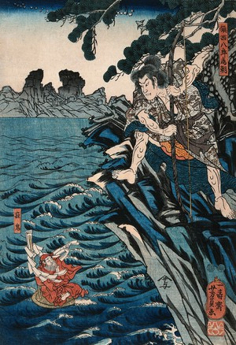
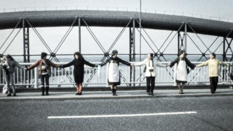
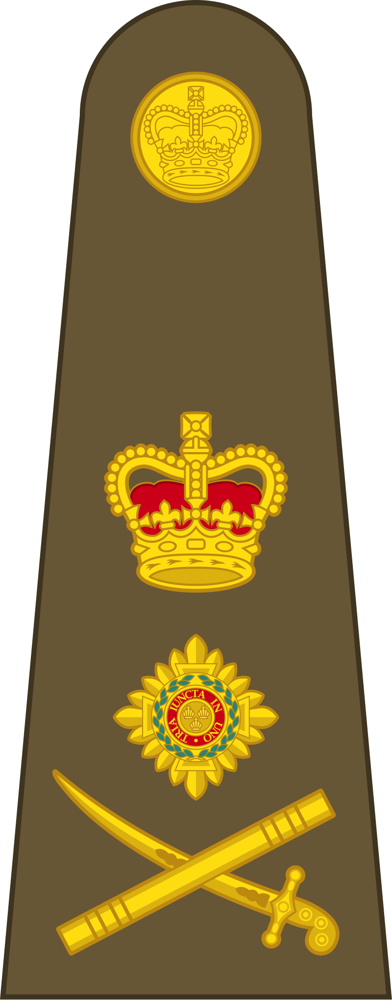
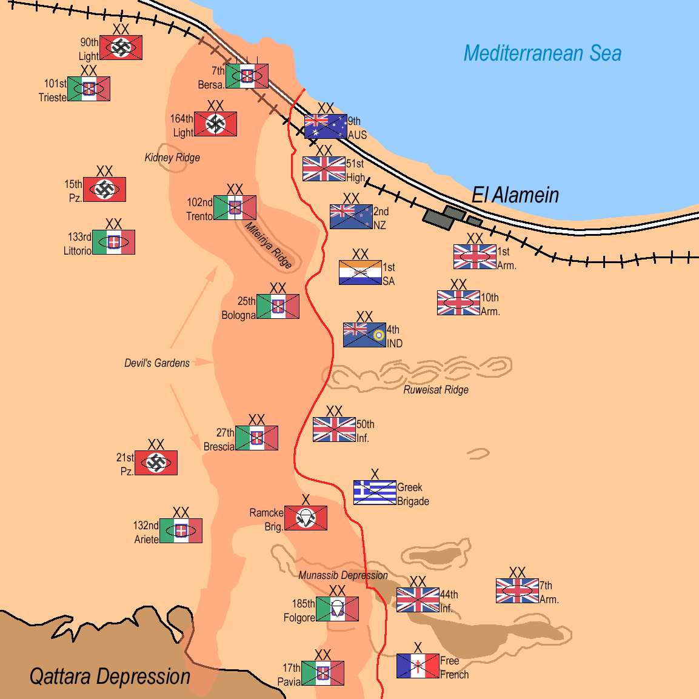
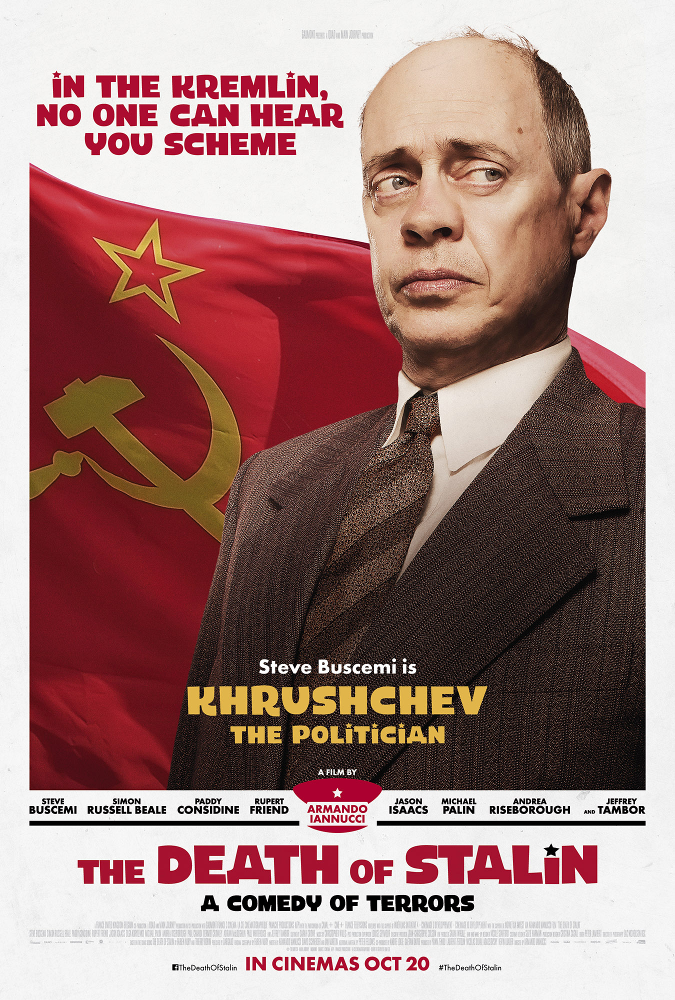
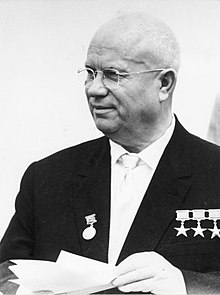
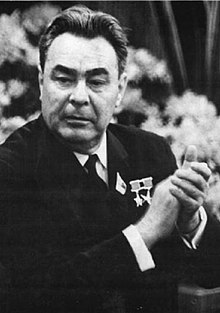
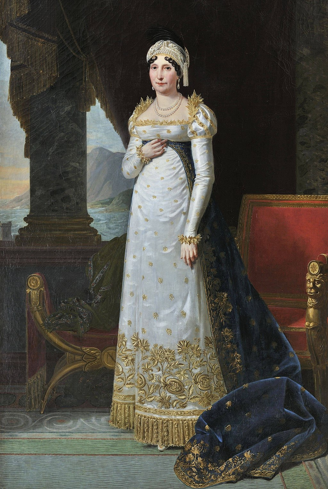

# History

Questions on, or vaguely related to, history

## History of Diseases, Viruses and Pandemics

Which Mythological Greek God was the god of both disease and healing? They sided with the Trojans in the Trojan war, infecting the Greeks with a plague, caused the death of Achilles and gave their name to a space program.
> Apollo, Son of Zeus and god of the Sun, Light, Oracles, Knowledge, Healing, Diseases, Music, Poetry, Songs, Dance, Archery, Herds, Flocks and Protection of the Young

For half a point each, name two of the 10 Plagues of Egypt.
> Water to Blood, Frogs, Lice/Gnats, Wild Animals / Flies, Pestilence of Livestock, Boils, Thunderstorms of Hail and Fire, Locusts, Darkness, Death of Firstborn

This work of art depicts 12th century figure Tametomo banishing a demon, which represents a what disease, which is notable for being the first disease to have a vaccine developed and the first to be completely eradicated?
> The disease is smallpox, which had a vaccine developed from the less harmful cowpox and has now been completely eradicated from humans.

Which word, derived from the greek for pollute and defined as a poisonous vapour or mist, was used to name the theory as to how the black death was transmitted?
> Miasma, the miasmatic theory of disease transmission remained popular for many years.

What was the name of this 16th century physician who served as a plague doctor, and whose prediction filled writings would later be suggested to have predicted several major world events and the end of the world?
> Nostradamus, who was also credited with creating a 'rose pill' that protected against the plague.

'A plague o' both your Houses', is a line from which play, spoken by a character currently dying from 'just a scratch'?
> Romeo & Juliet, as spoken by Mercutio.

Infectious Mononucleosis, or glandular fever, is a fairly mild disease that most commonly affects children and young adults, who mostly recover in 2 to 4 weeks. What is it's colloquial name?
> 'The Kissing Disease'

What is the name for an infectious germ, common in United States Primary Schools, that is similar to the Dreaded Lurgi and spreads through contact with the Opposite Sex?
> Cooties

In 2005 the 'Corrupted Blood' incident resulted in a pandemic sweeping across the World of Azeroth in which extremely popular Massively Multiplayer Online Role Playing Game (MMORPG)?
> World of Warcraft. A software bug allowed pets to retain a disease that was intended to be temporary, which was then transmitted to online population centres.

Stuxnet, discovered in 2010, which spread and infected its targets with the end goal of disrupting the machinery used in Iranian Nuclear Program, is an example of what?
> A computer virus or a computer worm.

This set of stickers was released by WhatsApp in response to the COVID-19 pandemic in partnership with which organisation, formed in 1948 by the United Nations?
> World Health Organisation (WHO)

a marvellous article: https://en.wikipedia.org/wiki/List_of_fictional_diseases

## History of Protest, Riot and Public Nuisance

Arctic Sunrise, Esperanza, Sirius, Solo and Rainbow Warrior are all names given to what?
> Ships, they are all ships that are/were operated by Greenpeace

What is this proclamation: "Our sovereign lord the King chargeth and commandeth all persons, being assembled, immediately to disperse themselves, and peaceably to depart to their habitations, or to their lawful business, upon the pains contained in the act made in the first year of King George, for preventing tumults and riotous assemblies. God save the King."
> The Riot Act, accept any vague answers

According to the Hitchiker's Guide to the Galaxy, which department of the Sirius Cybernetics Corporation is described as "A Bunch of Mindless Jerks, who'll be first against the wall when the revolution comes"? Sales, Marketing or Engineering?
> Marketing

In 1975, a University Challenge team from the University of Manchester protested that oxbridge colleges were permitted to enter individually by answering every question with either "Lenin", "Trotsky", "Marx" or the name of which Argentine Marxist, who is a global pop culture icon of rebellion?
> Che Guevara

Who's Logo is this?
> Extinction Rebellion

The Largest single Anti-War Rally in History is recorded as involving around 3,000,000 people in Rome, which was one of a coordinated global day of protest. To which war were they expressing opposition?
> The 2003 Invasion of Iraq by the United States

The album art for Rage Against the Machine's eponymous debut album depicts what act of protest?
> Self-immolation

Which punk rock band, whose career spans 30 years and achieved renewed success following a different 2004 antiwar track, altered the breakdown of their song 'Bang Bang' to chant 'No Trump, No KKK, No Fascist USA' at a 2016 performance.
> Green Day, the 2004 track was American Idiot

What did the People's Front of Judea daub on the walls of Pontius Pilate's Palace?
> Romans Go Home, Romanes eunt domus, Romani ite domum

"Milk", "Pride", "Philidelphia" and "Selma" are all politically centric films with civil rights themes, which is the odd one out?
> Selma. Milk, Pride and Philadelphia all relate to the rights of the LGBT community, while Selma is about the civil rights movement and MLK

Greenham Common Women's Peace Camp was established in 1981 and remained in some form in Berkshire for 19 years before it was disbanded. The group used a spider and are most well known for their "embrace the base" protest, where 30,000 women formed a 14 Mile long human chain. What were they opposing?
> Nuclear Weapons / Specifically the placement on nuclear weapons on the air base. The nuclear weapons were removed from the base in 1991.

What was the root cause of riots in Montreal in 1986 and 1993, and Vancouver in 1994 and 2011?
> The Stanley Cup, the final of the NHL

Which sport also caused the riot pictured here, during an invitational event in Melbourne contested by Simon Whitlock and Michael van Gerwen?
> Darts

To whom does this placard refer, from a protest on the 4th of June 2019?
> Donald Trump

Following the death of Rue, District 11 broke out into a massive riot and uprising in which film?
> The Hunger Games

Name any artist who has refused to allow Donald Trump to use their music.
> Neil Young, Rihanna, Elton John, REM, Adele, Rolling Stones, Guns N Roses, Pharrell Williams, Queen, Earth Wind and Fire,George Harrison, Pavarotti, Prince, Aerosmith, Twwisted Sister,

“‘Cause I'm just a girl, I'd rather not be
Cause they won't let me drive late at night
Oh, I'm just a girl, guess I'm some kind of freak
'Cause they all sit and stare with their eyes”
Are lyrics from who?
> Gwen Stefani, No Doubt

## General Knowledge

What rank is represented by these insignia?
> General

Whose Shield is Vitalstatistix carried on in the Asterix and Obelix books? The shield belonged to the Gallic Cheif who defeated Julius Caesar at the battle of Gergovia, but was defeated at the Battle of Alesia.
> Vercingetorix

Who sings these lyrics in 'Hamilton'?
>'I need my right hand man back

>Alexander Hamilton
>Troops are waiting in the fields for you
>If you join us right now, together
>We can turn the tide'

> General George Washington

Beethoven's Opus 91, the 'Battle Symphony', was commissioned to commemorate the victory of which commander at the Battle of Vitoria? This victory resulted in the his promotion to Field Marshal, a rank he retained when he later commanded the Waterloo Campaign.
> Arthur Wellesley, Duke of Wellington or, as he was at the time, Lieutenant General Wellesley, Marquess of Wellington. The piece is also known as Wellington's Victory

Who wrote this poem, 'The General', and served as a mentor for Wilfred Owen:
>'“Good-morning, good-morning!” the General said
>When we met him last week on our way to the line.
>Now the soldiers he smiled at are most of 'em dead,
>And we're cursing his staff for incompetent swine.
>“He's a cheery old card,” grunted Harry to Jack
>As they slogged up to Arras with rifle and pack.
>
>But he did for them both by his plan of attack.'

> Siegfried Sassoon

Name any commander for either set of belligerents at the (2nd) Battle of El Alamein
> General Montgomery, General Rommel

Name either of these two, who served as generals in the Second World War, and succeeded (1st and 2nd respectively) Joseph Stalin as General Secretary of the Central Committee of the Communist Party of the Soviet Union.
> Lieutenant General Nikita Khrushchev, Major General Leonid Brezhnev

Who did the US military attempt to drive out of the Vatican Embassy in Panama by blasting non-stop metal music at the embassy?
> General Manuel Noriega

Name any of the commanders for either the Republic or the Separatists at the Battle of Coruscant, as depicted in the opening of the film 2005 Revenge of the Sith.
> General Kenobi, General Skywalker, General Grievous, General Shaak Ti, Count Dooku

Who was nominated for the position of Secretary of Defense by Donald Trump in 2017. He held the position for two years, and was a former marine nicknamed 'Mad Dog'.
> General Jim 'Mad Dog' Mattis

In 2017, an over-enthusiastic academic applied sabermetrics to all recorded battles on Wikipedia, to determine the 'best' tactitian. Who came first; who is this woman's son?
> Napoleon Bonaparte

Three companies in the top 100 of the Fortune 500 have names beginning with 'General'. Give any of them.
> General Electric, General Motors, General Dynamics

What is the name of the General portrayed by Stephen Fry in 'Blackadder Goes Forth'. The character is distantly related to a Lord from 'Blackadder the Second'.
> General Melchett

