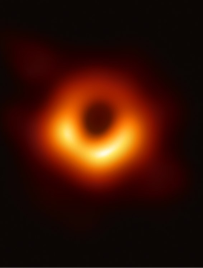
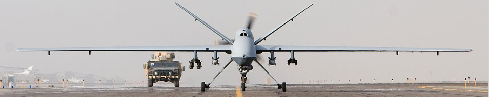

# Muse

Matt Bellamy first learned to play the piano, and draws from a variety of classical musicians as influences. His work frequently draws inspiration from which Russian composer, known for writing piano music that required large hands to play? [butterflies.wav]
> Rachmaninov

Track 5 of Muse’s third album Absolution is named after which ‘contested illness’, which was defined and coined following a bank robbery in 1983 and is characterised by ‘A hostage's development of positive feelings towards the captor’?
> Stockholm Syndrome

Muse’s most successful song in terms of UK chart performance, peaking at #4 in 2006, is named after a large astronomical body. What is the name of the song/body?
> Supermassive Black Hole

You’ll hear an acoustic cover snippet of a song from Muse’s second album ‘Origin of Symmetry’. Name the song. [feelinggoodpause.wav]
> Feeling Good

Muse’s 2010 song ‘Neutron Star Collision (Love is Forever) was the lead single of a soundtrack album for a movie installment of which series of best-selling young adult novels?
> Twilight

Muse’s 2009 Album the Resistance, featuring the songs Uprising, Resistance and United States of Eurasia draws heavily from which dystopian novel in themes and inspiration?
> 1984

The instrumental solo ‘Collateral Damage’ following the song United States of Eurasia is based on a solo pieces for piano by Chopin.
This piece is one of a series of 21 pieces evocative of the night. What’s the name for this series?
> Nocturnes

“In an isolated system; the entropy can only increase”, this lyric from Muse’s 2012 album refers to which Law of Thermodynamics, which is also the title of the album?
> 2nd Law

The first single of the album, ‘Survival’ described by critics as ‘a hilarious five-minute onslaught of camp, falling somewhere between Queen, Gloria Gaynor and a Monty Python sketch.’ served as the official theme song of which event?
> The London Olympics

The 5th track of Muses 2015 album ‘Drones’ is named after the UAV below.
What is the name of the drone or the song title?
> Reaper (allow predator)
