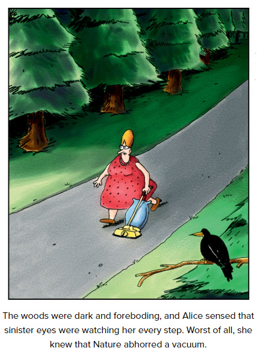

## San Francisco

What tradgedy struck San Francisco, and is the third most deadly disaster in the history of the United States?
> 1906 Earthquake and Fire

Which San Francisco landmark has proved an enduring inspiration and feature for Pop Culture, hosting an exhibit by Ai Weiwei, featuring in the films the Book of Eli and X-Men Last Stand, and inspiring the Prison of Azkaban?
> Alcatraz

what is the colour of the Golden Gate Bridge?
> International Orange, variants also named international orange are used by Nasa

Who wrote the novel 'East of Eden'? Set in the Salinas Valley south of San Francisco, it discusses the interwoven stories of the Trasks and the Hamiltons, with significant references to the biblical story of Cain and Abel?
> John Steinbeck, who also wrote Cannery Row set in nearby Monterey Bay

The Neighbourhood of Haight-Ashbury is known as the birthplace of which countercultural movement?
> Hippies

Rising to prominence during the 1960s, which neighbourhood of San Francisco is one of the major hubs of LGBT activism and events in the world?
> The Castro District

Which Northern California Serial Killer identified themselves with this symbol?
> The Zodiac Killer

Getting his big break when his comic was serialised by the San Francisco Chronicle, following less success with it's predecessor 'Nature's Way' in Seattle, name the cartoon and cartoonist behind such gems as Cow Tools and the comic shown.
> Gary Larson, The Far Side

In Star Trek IV: The Voyage Home, James T. Kirk and crew travel back in time to 1980s San Francisco in search of what to answer an Alien Signal from a ship terrorising earth in the 23rd century?
> A humpback whale

Which American Football Quarterback who last played for the San Francisco 49ers, has been frozen out of the NFL following his kneeling protests during the National Anthem; "I am not going to stand up to show pride in a flag for a country that oppresses black people and people of color."
> Colin Kaepernick

The 2011 film 'Moneyball', covering the application of Sabermetrics in baseball centres around the 'Athletics', who were based in which Bay Area city, also once home to the Raiders and the Golden State Warriors?
> Oakland