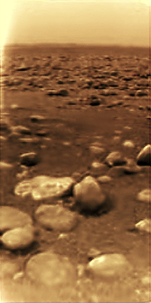
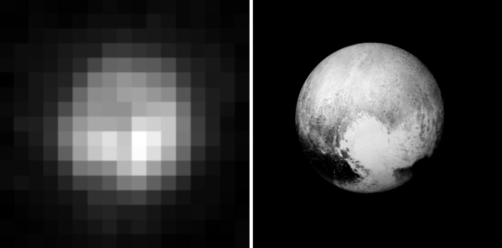
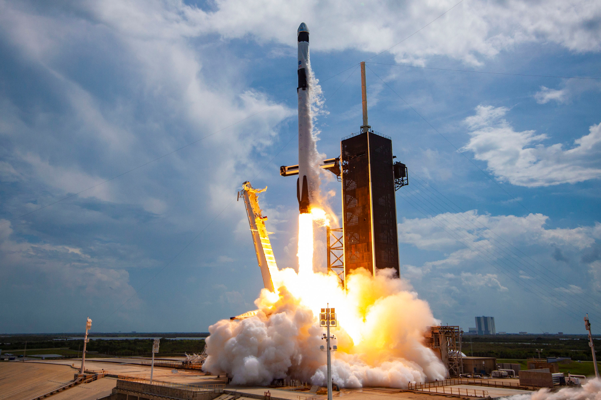

## Space Travel (Real)

Who was the first person to conduct a space flight?
> Yuri Gagarin

With over 1700 flights since its debut in 1966, what is the name for the Soviet family of rockets that is the most frequently used launch vehicle in the world.
> Soyuz

What do you use to provide the 'sling' in a gravitational slingshot (also known as a gravity assist?
> A large body / planet / moon

The first orbiter of Space Shuttle program was originally planned to be named Constitution, however public pressure resulted in it being renamed to what?
> Enterprise

On June 4 1996, Ariane 5 Flight 501 disintegrated due to a mistake in the software of the inertial navigation system. What is the name for this type of software failure, of which this is one of the most expensive examples, costing $370 Million.
> Software bug

What was the name of the Soviet space station that operated up to 2001, when it was deorbited?
> MIR

Which is the only known body aside from Earth to have stable bodies of surface liquid, the only moon with a dense atmosphere, and the source of this photo, the only surface photo taken from a body further away than Mars?
> Titan

What did the Rosetta Space Probe intercept to study, and succesffully deployed the lander Philae to the surface of?
> A comet, specifically 67P/Churyumov-Gerasimenko

Which body is shown here, photographed in 1996 by the Hubble Telescope and in 2015 by New Horizons?
> Pluto

What feature/capability of the boost stage of the Falcon 9, as used this week to send two crew to the ISS, allows it to be re-used?
> It can land itself, with the help of a drone platform if needed.
